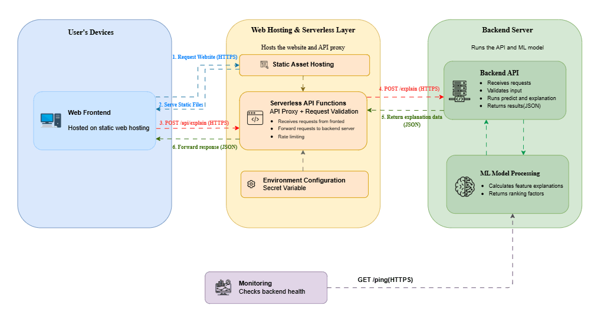
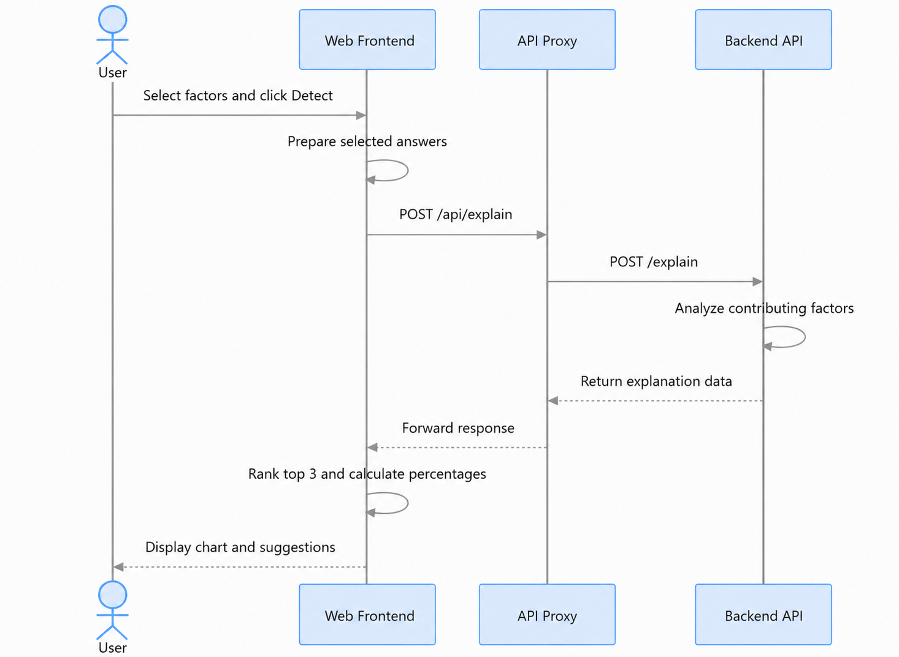

# Alopecia Factors Detector

A web app that helps people explore lifestyle and health-related factors that may contribute to hair loss. Users switch on the factors that apply to them, and the app shows the top three contributing factors with a pie chart and practical suggestions for each.

**Live site:** https://alopecia-factors-detector-web-application.pages.dev/

> This tool provides general information and is not a medical diagnosis. If you experience sudden, patchy, painful, or persistent hair loss, consult a dermatologist.

## Features

- Animated introduction and a clean, responsive interface with light and dark themes
- Toggle-based selection of 13 factors, grouped by category
- AI-style loading screen while the analysis runs
- Top 3 contributing factors, ordered from highest to lowest impact
- Pie chart with percentage shares
- Expandable suggestions for each factor
- Accessible controls and reduced-motion support

## System architecture

## UML diagram

## Tech stack

| Layer | Technology |
|---|---|
| Frontend | HTML, CSS, JavaScript (ES modules, no framework) |
| Hosting | Cloudflare Pages |
| API proxy | Cloudflare Pages Functions |
| Backend | Flask API hosted on Render |

## Disclaimer

AI predictions are not 100% accurate and should not be considered a definitive diagnosis.

## License

Copyright © 2026 Mutasim Fouad Showmik. All rights reserved. See [LICENSE](LICENSE).